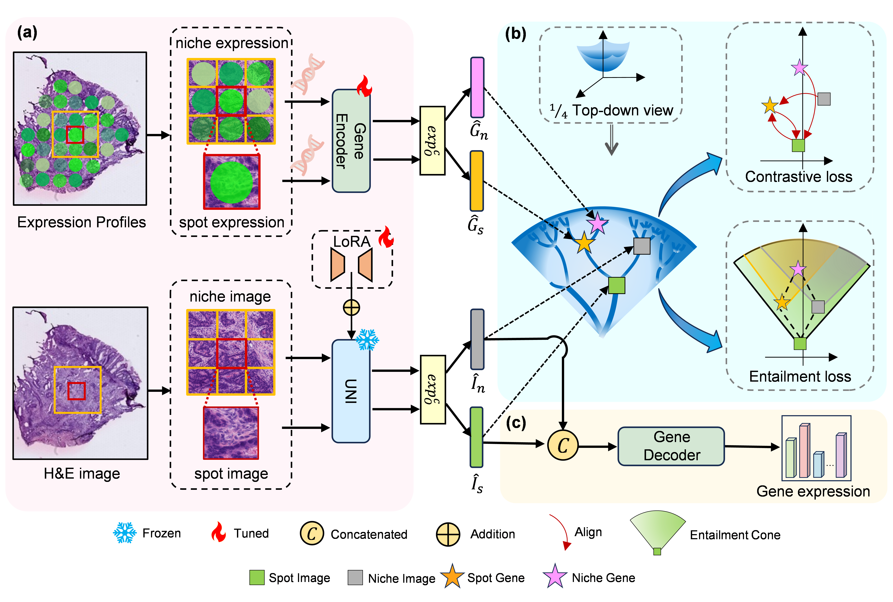

# HyperST: Hierarchical Hyperbolic Learning for Spatial Transcriptomics Prediction


<div align="center"><i>Figure 1. Architecture overview of HyperST framework.</i></div>


## 🛠️ Installation
Create a new conda environment and activate it:
```bash
conda env create -f environment.yml
conda activate HyperST
```

## 📥 Data Download
### HEST Dataset Download
1. Request access from [HEST Database](https://github.com/mahmoodlab/HEST)
2. Execute download notebook: [dataset_download_hest1k.ipynb](dataset_download_hest1k.ipynb)


>⚠️ Critical Fix: 
If `hest.py` fails to download correctly in dataset_download_hest1k, replace the faulty version in:
`~/.cache/huggingface/modules/datasets_modules/datasets/MahmoodLab--hest/` with the corrected version [hest.py](hest.py) provided in this repository.


### Dataset Structure
```txt
hest1k_datasets/
└── {DATASET_NAME}/
    ├── wsis/                  # Whole-slide H&E images
    ├── st/                    # Spatial transcriptomics (.h5ad)
    └── processed_data/
        ├── selected_gene_list.txt        # HMHVG genes
        ├── selected_hvg_gene_list.txt    # HVG genes
        └── all_slide_lst.txt             # Slide IDs

```

## 🔄 Data Preprocessing
Before training, raw data must be preprocessed.

### Kidney
```bash
bash ./scripts/data_proprocess/kidney.sh 
```

## 🏋️ Pretrained Models (UNI)

please also follow their respective installation requirements in GitHub/HuggingFace to access the weight of 
[UNI](https://github.com/mahmoodlab/UNI/tree/main) .


## 🧩 Dataset Splitting
```bash 
bash ./scripts/split/kidney.sh 
```

##  🚀 Model Training
Before running: Insert your HuggingFace token in scripts
```bash
bash ./scripts/train/hyperst/train_HVG.sh
bash ./scripts/train/hyperst/train_HMHVG.sh
```

## 📊 Results Structure
```txt
experiments/
└── hyperst/
    └── $EXPERIMENT_NAME/
        └── $DATASET_NAME/
            ├── sample_split_flod_0/
            │   ├── checkpoints/       # Model checkpoints
            │   └──samples/           # Gene predictions for test samples   
            └── ... (other folds)
```
